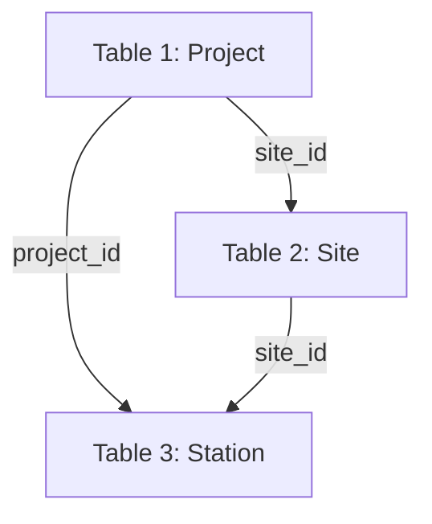
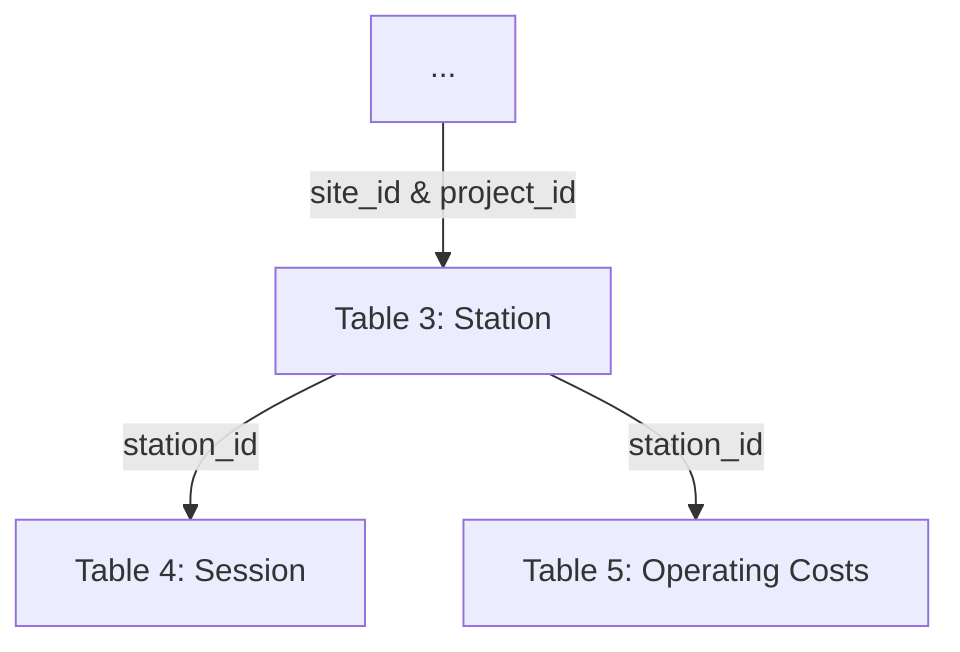

# Core Registration and Session Data Collection Reference

This document outlines the process, structure, and format for: 1) registering projects, and associated sites and stations, and 2) collecting core station operating (session & cost) data. These data are then [validated](validation-reference.md) with the resulting information compiled into standard [reporting metrics](reporting-metric-reference).

1. **Registration data** contains records of each project, site and station deployed by the program. These data are collected from the [obligated party](../glossary.md) or [data provider](../glossary.md) at the point of funding by the [program administrator](../glossary.md) and then transmitted to the [data aggregator](../glossary.md).

2. **Use (session) data** contains records of the individual charging sessions at program-funded stations. These data are collected for each reporting period by the [data provider](../glossary.md) and transmitted to the [data aggregator](../glossary.md). Registration information is also used in specification extensions linking to cost [[FORTHCOMING]](roadmap.md), reliability [[FORTHCOMING]](roadmap.md), and grid impact [[FORTHCOMING]](roadmap.md) reporting specifications.

## Contents

1. [Program Registry and Onboarding Process](#program-registry-and-onboarding-process)

	 1. [Project Registration](#project-registration)
	 2. [Site Registration](#site-registration)
	 3. [Station Registration](#station-and-port-registration)

2. [Operating Data Collection](#operating-data-collection)

# Program Registry and Onboarding Process

The program registry contains entries for all charging stations deployed by program funding and is a critical component of the evaluation, measurement, and verification process because it contains the reference information required for program reporting activities. Project registration data is collected and maintained by the [program administrator](../glossary.md) or [data aggregator](../glossary.md). Recommended practice is to integrate registration data collection with administrative onboarding processes to reduce duplicative effort and ensure that all necessary registration data collection occurs prior to funding disbursement. Figure 1 shows the program registry hierarchy with individual identifying keys that link the entries together.

**Figure 1. Registration Hierarchy**

Project registration is tied to a single [obligated party](../glossary.md) and records project-level information such as funding source and amounts. Projects are limited to a single physical address but may cover many individual charging station deployments. Site registration (based on address) is recorded in parallel with project onboarding. While a project is limited to a single site, a site may receive funding from multiple projects over time. If a second project is applied to a site that is already in the system, then it should be linked to the existing site rather than generating a new site entry.

Because charging stations generate usage data, they are the fundamental reporting unit in the program registry. Sessions and other usage data are linked to stations, which inherit all above attributes, making it possible to link each session to the associated site, project, and [obligated party](../glossary.md). In many cases, the [obligated party](../glossary.md) will not be the organization that directly collects charging use data. Instead, many obligated parties will deploy chargers managed by a third party that monitors station usage.

To facilitate efficient data sharing, the third party that monitors station usage may also be designated as the [data provider](../glossary.md), which allows for direct data transfer to the [data aggregator](../glossary.md) and may also provide efficiencies of scale if the third-party [data provider](../glossary.md) is contracted with multiple obligated parties. In this case, the participant must provide the [program administrator](../glossary.md) with station identifiers that are consistent with those used by the [data provider](../glossary.md) as well as the necessary credentials and information to access reported usage data. See model language for data collection [[FORTHCOMING]](roadmap.md) for sample language to facilitate the efficient collection of data.

*Fields marked as required must be included to comply with the specification, while optional fields may be made required at the discretion of the program administrator*

## Project Registration

During project onboarding the [program administrator](global-reference.md) will collect and record project-level information from the applicant [obligated party](../glossary.md) as outlined in Table 1. Project registration includes applicant information and general information on project funding including public/utility funding source and amount, and must be associated with a single geographic location (site). If detailed cost information, including itemized installation costs are desired, please see the installation costs extension [[FORTHCOMING]](roadmap.md).

Refer to [Field Type and Format Reference](../field-type-and-format-reference.md) for more information on field types and formats. *Additional fields may be appended as new columns are needed, but existing columns and their formats should be maintained to support compatibility.*

**Table 1: Project Registration**

| Field | Description | Field Type | Required |
| --- | --- | --- | --- |
| **project\_id** | Unique identity specific project | Data ID (unique) | yes |
| **site\_id** | Unique identity specific to the address-specific site | ID (foreign) | yes |
| **org\_name** | Organization name of the obligated party | string | yes |
| **project\_award\_date** | Date when project funding was awarded | date | yes |
| **poc\_email** | Obligated party point of contact email address | email | yes |
| **poc\_first\_name** | Obligated party point of contact first name | string | yes |
| **poc\_last\_name** | Obligated party point of contact last name | string | yes |
| **primary\_funding\_source** | Primary public funding source for the project/application | string | yes |
| **primary\_funding\_type** | Primary public funding source for the project/application | string | yes |
| **primary\_funding** | Amount of funding station received from the primary funding source dedicated to the charging site (can include funds for installation, e.g., make-ready, equipment, and site preparation, but should not include any funding for station operation) | currency (USD) | yes |
| **utility\_makeready** | Amount of funding the project received from electric utilities dedicated to infrastructure make-ready | currency (USD) | no |
| **utility\_funding\_other** | Amount of funding the project received from utility for equipment or other non-make-ready costs (should not include any funding for operational costs) | currency (USD) | no |
| **other\_makeready** | Amount of other public funding station received dedicated to infrastructure make-ready | currency (USD) | no |
| **other\_funding\_other** | Amount of other public funding project received for equipment or other non-make-ready costs (should not include any funding for operational costs) | currency (USD) | no |
| **cost\_share** | Funding amount project has received from other (private, non-utility) sources when combined with primary\_funding and utility\_funding and other\_public\_funding equals the total cost of the charging installation | currency (USD) | no |
| **in\_dac** | Project is located inside of disadvantaged community as defined by local jurisdiction | TRUE/FALSE | no |
| **dac\_proximate** | Project is located within a program specified distance from disadvantaged community as defined by local jurisdiction | TRUE/FALSE | no |
| **total\_power** | The total charger power capacity (in kW) deployed by the project - if stations share power supplies, only the maximum simulataneous power output should be reported | non-negative float | no

## Site Registration

Also during project onboarding, the [program administrator](../glossary.md) will collect site information from the applicant [obligated party](../glossary.md). If the site address of the project matches a site already in the site registry, then the project should be associated with the existing site\_id.

**Table 2: Site Registration**

| **Field** | **Description** | **Data Format** | **Required** |
| --- | --- | --- | --- |
| **site\_id** | Unique identity specific to the site, must be consistent across reporting periods | ID (unique) | yes |
| **site\_name** | Descriptive name of charging site (e.g., Mercy Hospital) | string | yes |
| **address\_1** | Site street address line one (e.g. 1600 Pennsylvania Ave NW) | string | yes |
| **address\_2** | Site address line two, (e.g. Unit 1) | string | no |
| **city** | Site city | string | yes |
| **state** | Site state (full name) | string | yes |
| **zip\_code** | Site ZIP code | ZIP code | yes |
| **operating\_status** | Operational status of station (Active or Inactive) at time of inventory | string | yes |
| **access\_type** | Type of access available (public/unrestricted, private/restricted) | string | yes |
| **site\_type** | Type of site host for the charging site. | string | yes |
| **host\_first\_name** | Location site host point of contact first name | string | yes |
| **host\_last\_name** | Location site host point of contact last name | string | yes |
| **host\_email** | Location site host point of contact email address | email | yes |
| **onsite\_generation** | Is there onsite energy generation at the site? | TRUE/FALSE | yes |
| **onsite\_generation\_type** | Type of onsite energy generation | string | no |
| **onsite\_generation\_power** | Nameplate capacity of onsite energy generation in kW | positive float | no |
| **onsite\_storage** | Is there onsite energy storage at the site? | TRUE/FALSE | yes |
| **onsite\_storage\_energy** | Energy capacity of onsite energy storage system in kWh | positive float | no |
| **onsite\_storage\_power** | Nameplate capacity of onsite energy storage system in kW | positive float | no |
| **county** | Site county (or county analogue) | string | no |
| **site\_type\_detail** | Additional detail on site host land use | string | no |

## Station and Port Registration

Also during project onboarding, the [program administrator](../glossary.md) will collect station and port information from the applicant [obligated party](../glossary.md). If usage data will be provided by a third-party [data provider](../glossary.md), collecting the station identifier used by that third party to identify specific stations in their system is a critical step in the onboarding process. This ensures that the [data aggregator](../glossary.md) can successfully link usage data secured from the [data provider](../glossary.md) to stations within the registry. The [program administrator](../glossary.md) should also have a process in place to update the station registration if a station is upgraded, taken offline, or if the [data provider](../glossary.md) is replaced.

Each station inherits the attributes of the site where it is located and the project that funded it. Station registration entries also include attributes specific to the individual charging station including exact location, power level, and other station-level attributes as listed in Table 3.

Refer to [Field Type and Format Reference](../field-type-and-format-reference.md) for more information on field types and formats. *Additional fields may be appended as new columns as needed, but existing columns and their formats should be maintained to support compatibility interoperability.*

**Table 3: Station Registration**

| **Field**   | **Definition** | **Data Format** | **Required** |
| --- | --- | --- | --- |
| **station\_id** | Unique identifier of charging station – must match the data provider ID for the station if managed by a third party data provider | ID (unique) | yes |
| **project\_id** | Project identifier | Data ID (foreign) | yes |
| **site\_id** | Location identifier | ID (foreign) | yes |
| **date\_entered** | Date when entry was created | date | yes |
| **station\_serial** | Unique identifier of charging station derived from station serial number or network identifier (e.g., 123-345-2) | ID (unique) | yes |
| **station\_name** | Name of charging station | string | yes |
| **data\_provider\_org** | Data provider organization name – may be the same as obligated party | string | yes |
| **data\_provider\_poc\_email** | Email address for data provider point of contact – may be the same as obligated party point of contact | email | yes |
| **is\_active** | Operational status of station at date entered | TRUE/FALSE | yes |
| **power\_level\_kw** | Maximum charging power level of the station in kilowatts | positive float | yes |
| **num\_ports** | Number of simultaneously usable ports | positive integer | yes |
| **latitude** | Station latitude | latitude | yes |
| **longitude** | Station longitude | longitude | yes |
| **station\_activation\_date** | The first (full or partial) day where the station is fully operable and accessible for its intended purpose | date | yes |
| **charger\_type** | Charging station type (level) | charger type | yes |
| **connector\_type** | Charging connector type(s) | connector | yes |
| **power\_level\_kw** | Maximum charging power level in kilowatts | positive float | yes |
| **energy\_fee** | Fee charged to user per kilowatt-hour | currency (USD) | no |
| **session\_fee** | Fee charged to user per session | currency (USD) | no |
| **time\_fee** | Fee charged to users per minute | currency (USD) | no |
| **parking\_fee** | Fee charged for parking if separate from time\_fee | currency (USD) | no |
| **idle\_fee** | Fee charged for minutes not charging if separate from time fee | currency (USD) | no |
| **operating\_hours** | Number of hours station is open per day—e.g., a station that is always open has a value of 24 whereas a station that is open from 6 am to 6 pm has a value of 12 | positive float | no |
| **model\_number** | Charging station model number | string or integer | no |
| **serial\_number** | Charging station serial number unique to charging equipment provider | string or integer | no |
| **data\_provider\_poc\_last** | Last name of the data provider point of contact | string | no |
| **data\_provider\_poc\_first** | First name of the data provider point of contact | string | no |
| **network** | Name of network service provider (if any) – may be same as data provider| string | no |
| **network\_contact** | Email address for network service provider – may be same as data provider | email | no |
| **evse\_manufacturer** | Charging equipment manufacturer name | string | no |

# Operating Data Collection

Station usage is tracked by collecting data on:
* **individual charging sessions** — the period between when a user connects their vehicle (plug in) and disconnects their vehicle (plug out).  
* **station operating costs** — summary data on energy, maintenance and repair costs over the reporitng interval.  
 
The [data provider](../glossary.md) collects session data for each reporting period as defined by the [program administrator](../glossary.md). The data is transmitted to the [data aggregator](../glossary.md) by the [data provider](global-reference.md) (or [obligated party](../glossary.md) in the case where they operate their stations). Session data includes key information about how, when, and, for how long a charger is in use. Session data is keyed to the station and individual port (for multiport stations) where it occurred and inherits all above attributes of the participant, project, and site as shown in Figure 2.

**Figure 2. Operating Data Reporting Hierarchy**

Generally, the [data provider](../glossary.md) may transmit operating data to the [data aggregator](../glossary.md) by: data portal, FTP, API, email, or other data sharing procedure. While data sharing is designed to be container agnostic, session data must conform to the format described in Table 5 and should be stored in (or convertible to) a broadly compatible container, such as a comma-separated values (CSV) file. Data transmissions procedure and file format may be further specified by the [program administrator](../glossary.md) to suit program needs.

Refer to [Field Type and Format Reference](../field-type-and-format-reference.md) for more information on field types and formats. *Additional fields may be appended as new columns as needed, but existing columns and their formats should be maintained to support compatibility.*

**Table 4: Session Reporting**

| **Field** | **Definition** | **Data Format** | **Required** |
| --- | --- | --- | --- |
| **session\_id** | Session identifier that is unique to port\_id and station\_id | ID (unique) | yes |
| **station\_id** | Station identifier | ID (foreign) | yes |
| **port\_number** | Port identifier that signifies which station port was used (1 for single port stations, 1,2+ for multiport stations) | non-negative integer | yes |
| **plug\_start\_datetime** | Date and time of session initialization (plug in) | date/time | yes |
| **plug\_end\_datetime** | Date and time of session terminatino (plug out)  | date/time | yes |
| **charge\_start\_datetime** | Date and time when charging began | date/time | yes |
| **session\_duration** | Total duration of session (plug in to plug out) | duration | yes  |
| **charging\_duration** | Total duration of time when electricity was actively dispensed - may not always be equal to the difference between charge\_start\_datetime and charge\_end\_datetime due to charge interruptions or managed charging | duration | yes |
| **energy\_kwh** | Electricity dispensed (in kilowatt-hours) during charging session | non-negative float | yes |
| **peak\_kw** | Session maximum power delivery (in kilowatts) | non-negative float | yes |
| **total\_fee\_charged** | The amount charged to the EV driver, in USD, where applicable - zero if driver was not charged for an otherwise paid charger, NULL if charger is not paid | currency (USD) | yes |
| **plug\_end\_datetime** | Session end (plug out) date time | date/time | no |
| **charge\_end\_datetime** | Charging end date time | date/time | no |
| **energy\_fee** | Fee charged to user per kilowatt-hour | currency (USD) | no |
| **session\_fee** | Fee charged to user per session | currency (USD) | no |
| **time\_fee** | Fee charged to users per minute | currency (USD) | no |
| **session\_initiator** | Method to initiate the charging session | string | no |
| **user\_id** | Anonymized network-specific id for each unique user | string | no |
| **successful\_completion** | Whether or not the session ended as expected | TRUE/FALSE | no |
| **ended\_by** | Cause of the session to end (e.g., unplugged while charging). | string | no |
| **start\_soc** | Battery state of charge at session start represented as a decimal between 0 and 1 | non-negative float | no |
| **end\_soc** | Battery state of charge at session end represented as a decimal between 0 and 1 | non-negative float | no |

**Table 5: Operating Costs Reporting**

| **Field** | **Definition** | **Data Format** | **Required** |
| --- | --- | --- | --- |
| **station\_id** | Station identifier | ID (foreign) | yes |
| **reporting\_period\_start** | Start date of operations costs reporting period | date | yes |
| **reporting\_period\_end** | End date of operations costs reporting period | date | yes |
| **maintenance\_cost** | Total amount paid for maintenance costs during reporting period | currency | yes |
| **repair\_cost** | Total amount paid for repair costs during reporting period | currency | yes |
| **electricity\_cost** | Total amount paid for station electricity use during reporting period (estimated if station is not individually metered) | currency | yes |
| **electricity\_disbursed** | Amount of energy in kWh delivered by station during reporting period | positive float | yes |

