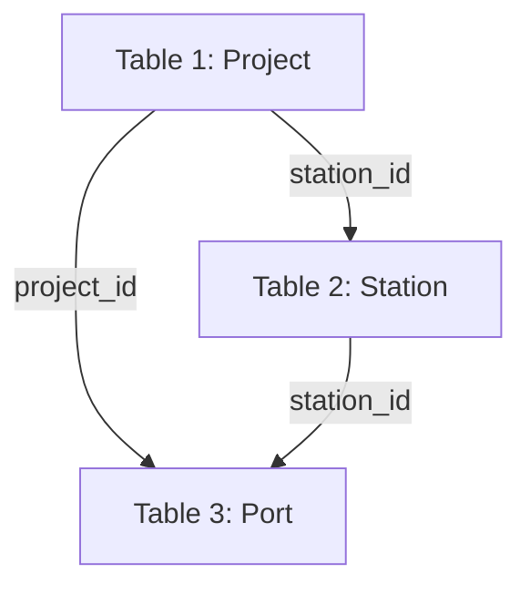
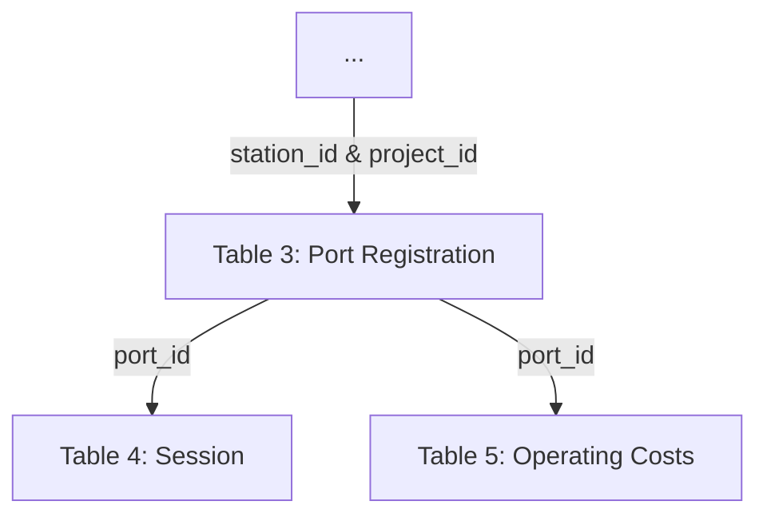

# Core Registration and Operating Data Collection Reference

This document outlines the process, structure, and format for: 1) registering projects, and associated stations and ports, and 2) collecting core station operating (session & cost) data. These data are then [validated](validation-reference.md) with the resulting information compiled into standard [reporting metrics](reporting-metric-reference).

1. **Registration data** contains records of each project, station and port deployed by the program. These data are collected from the [obligated party](../glossary.md) or [data provider](../glossary.md) at the point of funding by the [program administrator](../glossary.md) and then transmitted to the [data aggregator](../glossary.md).

2. **Use (session) data** contains records of the individual charging sessions at program-funded stations. These data are collected for each reporting period by the [data provider](../glossary.md) and transmitted to the [data aggregator](../glossary.md). Registration information is also used in specification extensions linking to cost [[FORTHCOMING]](roadmap.md), reliability [[FORTHCOMING]](roadmap.md), and grid impact [[FORTHCOMING]](roadmap.md) reporting specifications.

## Contents

1. [Program Registry and Onboarding Process](#program-registry-and-onboarding-process)

	 1. [Project Registration](#project-registration)
	 2. [Station Registration](#station-registration)
	 3. [Port Registration](#Port-and-port-registration)

2. [Operating Data Collection](#operating-data-collection)

# Program Registry and Onboarding Process

The program registry contains entries for all charging ports deployed by program funding and is a critical component of the evaluation, measurement, and verification process because it contains the reference information required for program reporting activities. Project registration data is collected and maintained by the [program administrator](../glossary.md) or [data aggregator](../glossary.md). Recommended practice is to integrate registration data collection with administrative onboarding processes to reduce duplicative effort and ensure that all necessary registration data collection occurs prior to funding disbursement. Figure 1 shows the program registry hierarchy with individual identifying keys that link the entries together.

**Figure 1. Registration Hierarchy**

Project registration is tied to a single [obligated party](../glossary.md) and records project-level information such as funding source and amounts. Projects are limited to a single physical address but may cover many individual charging port deployments. Station registration (based on address) is recorded in parallel with project onboarding. While a project is limited to a single station, a station may receive funding from multiple projects over time. If a second project is applied to a station that is already in the system, then it should be linked to the existing station rather than generating a new station entry.

Because charging ports generate usage data, they are the fundamental reporting unit in the program registry. Sessions and other usage data are linked to ports, which inherit all above attributes, making it possible to link each session to the associated station, project, and [obligated party](../glossary.md). In many cases, the [obligated party](../glossary.md) will not be the organization that directly collects charging use data. Instead, many obligated parties will deploy chargers managed by a third party that monitors port usage.

To facilitate efficient data sharing, the third party that monitors port usage may also be designated as the [data provider](../glossary.md), which allows for direct data transfer to the [data aggregator](../glossary.md) and may also provide efficiencies of scale if the third-party [data provider](../glossary.md) is contracted with multiple obligated parties. In this case, the participant must provide the [program administrator](../glossary.md) with port identifiers that are consistent with those used by the [data provider](../glossary.md) as well as the necessary credentials and information to access reported usage data. See model language for data collection [[FORTHCOMING]](roadmap.md) for sample language to facilitate the efficient collection of data.

*Fields marked as required must be included to comply with the specification, while optional fields may be made required at the discretion of the program administrator*

## Project Registration

During project onboarding the [program administrator](global-reference.md) will collect and record project-level information from the applicant [obligated party](../glossary.md) as outlined in Table 1. Project registration includes applicant information and general information on project funding including public/utility funding source and amount, and must be associated with a single geographic location (station). If detailed cost information, including itemized installation costs are desired, please see the installation costs extension [[FORTHCOMING]](roadmap.md).

Refer to [Field Type and Format Reference](../field-type-and-format-reference.md) for more information on field types and formats. *Additional fields may be appended as new columns are needed, but existing columns and their formats should be maintained to support compatibility.*

**Table 1: Project Registration**
|Field Name            |Description                                                                                                                                                                                                             |Type    |Default|Part 680 Requirement|
|----------------------|------------------------------------------------------------------------------------------------------------------------------------------------------------------------------------------------------------------------|--------|-------|--------------------|
|project_id            |Unique identification code specific to individual funding application or contract. Project ID is supplied by [Department] upon approval of funding.                                                                     |string  |yes    |yes                 |
|station_id            |Unique identity specific to the physical location of the station (site) funded by the project. Station ID must be same as the permanent station identifier provided to third parties pursuant to CFR 23 § 680.116(c)(1).|string  |yes    |yes                 |
|org_name              |Organization name of the obligated party.                                                                                                                                                                               |string  |yes    |no                  |
|org_address           |Street address of obligated party.                                                                                                                                                                                      |string  |yes    |no                  |
|org_city              |City of obligated party.                                                                                                                                                                                                |string  |yes    |no                  |
|org_state             |Valid state code of obligated party.                                                                                                                                                                                    |string  |yes    |no                  |
|org_zip               |Valid ZIP Code of entity responsible for operation and maintenance of the of the funded charging station.                                                                                                               |string  |yes    |no                  |
|poc_email             |Obligated party point of contact valid email address                                                                                                                                                                    |string  |yes    |no                  |
|poc_first_name        |Obligated party point of contact first name                                                                                                                                                                             |string  |yes    |no                  |
|poc_last_name         |Obligated party point of contact last name                                                                                                                                                                              |string  |yes    |no                  |
|project_award_date    |Date when project funding was awarded                                                                                                                                                                                   |date    |yes    |no                  |
|primary_funding_source|Primary public funding source for the project/application                                                                                                                                                               |string  |yes    |no                  |
|primary_funding       |Total funding (in USD) station received from the primary funding source dedicated to station deployment. (should not include any funding for station operation costs)                                                   |float(2)|yes    |no                  |
|utility_makeready     |Total funding (in USD) the project received from electric utilities dedicated to infrastructure make-ready                                                                                                              |float(2)|yes    |no                  |
|utility_funding_other |Total funding (in USD) the project received from utility for equipment or other non-make-ready costs (should not include any funding for operational costs)                                                             |float(2)|yes    |no                  |
|other_makeready       |Total funding (in USD) other public funding received dedicated to infrastructure make-ready                                                                                                                             |float(2)|yes    |no                  |
|other_funding_other   |Amount of other public funding project received for equipment or other non-make-ready costs (should not include any funding for operational costs)                                                                      |float(2)|yes    |no                  |
|cost_share            |Funding amount project has received from other (private, non-utility) sources when combined with primary_funding and utility_funding and other_public_funding equals the total cost of the charging installation        |float(2)|yes    |no                  |
|equipment_cost        |Cost (in USD) to acquire funded charging equipment.                                                                                                                                                                     |float(2)|no     |yes                 |
|install_cost          |Cost (in USD) for all labor and materials costs (including electrical equipment) necessary to necessary to install charging equipment.                                                                                  |float(2)|no     |yes                 |
|property_cost         |Cost (in USD) to acquire real property on which to install funded chargers.                                                                                                                                             |float(2)|no     |yes                 |
|der_equipment_cost    |Cost (in USD) to acquire distributed energy resource equipment.                                                                                                                                                         |float(2)|no     |yes                 |
|der_install_cost      |Cost (in USD) for all labor and materials costs (including electrical equipment) necessary to install distributed energy resources equipment.                                                                           |float(2)|no     |yes                 |
|distribution_costs    |Cost (in USD) of contributions in aid of construction for line extensions and upgrades necessary to install chargers.                                                                                                   |float(2)|no     |yes                 |
|service_costs         |Cost (in USD) of contributions in aid of construction for service upgrade costs for customer transformers, poles, meters, and other utility service equipment necessary to install chargers.                            |float(2)|no     |yes                 |
|dac_type              |Method, model or program definition of disadvantaged community. For example CEJST 1.0.                                                                                                                                  |string  |no     |no                  |
|in_dac                |Project is located inside of disadvantaged community as specified by dac_type.                                                                                                                                          |boolean |no     |no                  |
|dac_proximate         |Project is located within a program specified distance from disadvantaged community as as specified by dac_type.                                                                                                        |boolean |no     |no                  |
|total_power           |The total charger power capacity (in kW) deployed by the project - if charging equipment share power supplies, only the maximum simulataneous power output should be reported.                                          |float   |no     |no                  |

## Station Registration

Also during project onboarding, the [program administrator](../glossary.md) will collect station information from the applicant [obligated party](../glossary.md). If the station address of the project matches a station already in the station registry, then the project should be associated with the existing station\_id.

**Table 2: Station Registration**

|Field Name            |Description                                                                                                                                                                                                             |Type    |Default|Part 680 Requirement|
|----------------------|------------------------------------------------------------------------------------------------------------------------------------------------------------------------------------------------------------------------|--------|-------|--------------------|
|station_id            |Unique identity specific to the physical location of the station (site) funded by the project. (For NEVI/Part 680 programs, Station ID must be same as the permanent station identifier provided to third parties pursuant to CFR 23 § 680.116(c)(1).|string  |yes    |yes                 |
|station_name          |Descriptive name of charging site (e.g., Mercy Hospital).                                                                                                                                                               |string  |yes    |no                  |
|station_address       |Street address of charging station.                                                                                                                                                                                     |string  |yes    |yes                 |
|station_city          |City where charging station is located.                                                                                                                                                                                 |string  |yes    |yes                 |
|station_state         |Valid state code of state where station or territory where the station is located                                                                                                                                       |string  |yes    |yes                 |
|station_zip           |Valid ZIP code of where station is located.                                                                                                                                                                             |string(5)|yes    |yes                 |
|station_county        |Station county (or county analogue)                                                                                                                                                                                     |string  |no     |yes                 |
|station_lon           |Station center WSG84-encoded longitude in decimal degrees to at least 4 decimal places. Valid longitudes are between -180 and 180                                                                                       |float(>3)|no     |yes                 |
|station_lat           |Station center WSG84 encoded latitude in decimal degrees to at least 4 decimal places. Valid latitudes are between -90 and 90.                                                                                          |float(>3)|no     |yes                 |
|operator_name         |Name of entity responsible for operation and maintenance of the funded charging station.                                                                                                                                |string  |yes    |yes                 |
|operator_address      |Street address of entity responsible for operation and maintenance of the funded charging station.                                                                                                                      |string  |yes    |yes                 |
|operator_city         |City of entity responsible for operation and maintenance of the funded charging station.                                                                                                                                |string  |yes    |yes                 |
|operator_state        |Valid state code of entity responsible for operation and maintenance of the funded charging station.                                                                                                                    |string  |yes    |yes                 |
|operator_zip          |Valid ZIP Code of entity responsible for operation and maintenance of the of the funded charging station.                                                                                                               |string(5)|yes    |yes                 |
|operating_status      |Valid Operating Status.                                                                                                                                                                                                 |string  |yes    |no                  |
|access_type           |Valid Access Type.                                                                                                                                                                                                      |string  |yes    |no                  |
|site_host_type        |Type of site host for the charging station. (e.g. public, workplace, MUD)                                                                                                                                               |string  |yes    |no                  |
|site_host_type_detail |Additional detail on site host land use. (e.g. hospital, hotel, parking garage, etc.)                                                                                                                                   |string  |no     |no                  |
|host_first_name       |Station host point of contact first name                                                                                                                                                                                |string  |yes    |no                  |
|host_last_name        |Station host point of contact last name                                                                                                                                                                                 |string  |yes    |no                  |
|host_email            |Station host point of contact email address                                                                                                                                                                             |string  |yes    |no                  |
|onsite_der            |Station has distributed energy resource.                                                                                                                                                                                |boolean |yes    |yes                 |
|onsite_der_type       |Valid Distributed Energy Resource Type                                                                                                                                                                                  |string  |       |yes                 |
|der_power             |Nameplate capacity of onsite energy generation in kW                                                                                                                                                                    |float(2)|no     |yes                 |
|der_energy            |Combined nameplate capacity of onsite energy generation and/or maximum battery discharge capacity in kilowatts (kW).                                                                                                    |float(2)|no     |yes                 |

## Port Registration

Also during project onboarding, the [program administrator](../glossary.md) will collect port information from the applicant [obligated party](../glossary.md). If usage data will be provided by a third-party [data provider](../glossary.md), collecting the port identifier used by that third party to identify specific ports in their system is a critical step in the onboarding process. This ensures that the [data aggregator](../glossary.md) can successfully link usage data secured from the [data provider](../glossary.md) to ports within the registry. The [program administrator](../glossary.md) should also have a process in place to update the port registration if a port is upgraded, taken offline, or if the [data provider](../glossary.md) is replaced.

Each port inherits the attributes of the site where it is located and the project that funded it. port registration entries also include attributes specific to the individual charging port including exact location, power level, and other port-level attributes as listed in Table 3.

Refer to [Field Type and Format Reference](../field-type-and-format-reference.md) for more information on field types and formats. *Additional fields may be appended as new columns as needed, but existing columns and their formats should be maintained to support compatibility interoperability.*

**Table 3: Port Registration**

|Field Name            |Description                                                                                                                                                                                                             |Type    |Default|Part 680 Requirement|
|----------------------|------------------------------------------------------------------------------------------------------------------------------------------------------------------------------------------------------------------------|--------|-------|--------------------|
|port_id               |Unique identifier for specified port. (For NEVI or other Part 680 project, port_id must be same as the permanent station identifier provided to third parties pursuant to CFR 23 § 680.116(c)(8)(iii).)                 |string  |yes    |yes                 |
|project_id            |Unique identification code specific to individual funding application or contract. Project ID is supplied by administrator upon approval of funding.                                                                    |string  |yes    |yes                 |
|station_id            |Unique identifier for the station where specific port is located.  (For NEVI or other Part 680 project, station_id must be same as the permanent station identifier provided to third parties pursuant to CFR 23 § 680.116(c)(1)).|string  |yes    |yes                 |
|data_provider_org     |Data provider organization name.                                                                                                                                                                                        |string  |yes    |no                  |
|data_provider_poc_email|Email address for data provider point of contact.                                                                                                                                                                       |string  |yes    |no                  |
|is_active             |Port operational status.                                                                                                                                                                                                |boolean |yes    |no                  |
|power_level_kw        |Maximum charging power level of the port (in kW)                                                                                                                                                                        |float   |yes    |yes                 |
|port_latitude         |Port WSG84-encoded longitude in decimal degrees to at least 4 decimal places. Valid longitudes are between -180 and 180                                                                                                 |float(>3)|yes    |no                  |
|port_longitude        |Port WSG84 encoded latitude in decimal degrees to at least 4 decimal places. Valid latitudes are between -90 and 90.                                                                                                    |float(>3)|yes    |no                  |
|station_activation_date|The first (full or partial) day where the station is fully operable and accessible for its intended purpose                                                                                                             |date    |yes    |no                  |
|charger_type          |Charging station type (level)                                                                                                                                                                                           |string  |yes    |yes                 |
|connector_type        |Valid Connector Type. Multiple connector types should be separated by commas.                                                                                                                                           |string  |yes    |yes                 |
|energy_fee            |Fee charged to user per kWh (in USD).                                                                                                                                                                                   |float(2)|no     |no                  |
|session_fee           |Fee charged to user per session (in USD).                                                                                                                                                                               |float(2)|no     |no                  |
|time_fee              |Fee charged to users per minute (in USD).                                                                                                                                                                               |float(2)|no     |no                  |
|parking_fee           |Fee charged for parking if separate from time_fee  (in USD).                                                                                                                                                            |float(2)|no     |no                  |
|idle_fee              |Fee charged for minutes not charging if separate from time fee  (in USD).                                                                                                                                               |float(2)|no     |no                  |
|operating_hours       |Number of hours station is open per day—e.g., a station that is always open has a value of 24 whereas a station that is open from 6 am to 6 pm has a value of 12.                                                       |float   |no     |no                  |
|equipment_manufacturer|Charging equipment or system manufacturer name.                                                                                                                                                                         |string  |no     |no                  |
|model_number          |Charging equipment or system model number.                                                                                                                                                                              |string  |no     |no                  |
|equipment_serial      |serial number of charging equipment or system.                                                                                                                                                                          |string  |no     |no                  |
|data_provider_poc_last|Last name of the data provider point of contact.                                                                                                                                                                        |string  |no     |no                  |
|data_provider_poc_first|First name of the data provider point of contact.                                                                                                                                                                       |string  |no     |no                  |
|network               |Name of network service provider.                                                                                                                                                                                       |string  |no     |no                  |
|network_contact       |Email address for network service provider.                                                                                                                                                                             |string  |no     |no                  |
|evse_manufacturer     |Charging equipment manufacturer name.                                                                                                                                                                                   |string  |no     |no                  |
|trailer_accessible    |Port located on pull through stall that can accommodate a vehicle and trailer                                                                                                                                           |boolean |no     |yes                 |
|payments_accepted     |Valid Payment Type.                                                                                                                                                                                                     |string  |no     |yes                 |

# Operating Data Collection

Port usage is tracked by collecting data on:
* **individual charging sessions** — the period between when a user connects their vehicle (plug in) and disconnects their vehicle (plug out).  
* **station operating costs** — summary data on energy, maintenance and repair costs over the reporitng interval.  

**Figure 2. Operating Data Reporting Hierarchy**

### Session Data
The [data provider](../glossary.md) collects session data for each reporting period as defined by the [program administrator](../glossary.md). The data is transmitted to the [data aggregator](../glossary.md) by the [data provider](global-reference.md) (or [obligated party](../glossary.md) in the case where they operate their ports). Session data includes key information about how, when, and, for how long a charger is in use over the course of a single session (plug in to plug out). Each individual session should be included in the data only once. If data is collected at a subsession interval, it should be aggregated to the session level by the data provider prior to delivery to the data aggregator. Session data is keyed to the individual port where it occurred and inherits all above attributes of the participant, project, and station as shown in Figure 2.

Generally, the [data provider](../glossary.md) may transmit session data to the [data aggregator](../glossary.md) by: data portal, FTP, API, email, or other data sharing procedure. While data sharing is designed to be container agnostic, session data must conform to the format described in Table 5 and should be stored in (or convertible to) a broadly compatible container, such as a comma-separated values (CSV) file. Data transmissions procedure and file format may be further specified by the [program administrator](../glossary.md) to suit program needs.

Refer to [Field Type and Format Reference](../field-type-and-format-reference.md) for more information on field types and formats. *Additional fields may be appended as new columns as needed, but existing columns and their formats should be maintained to support compatibility.*

**Table 4: Session Reporting**

|Field                 |Definition                                                                                                                                                                                                              |Data Format|Default|Part 680 Requirement|
|----------------------|------------------------------------------------------------------------------------------------------------------------------------------------------------------------------------------------------------------------|-----------|-------|--------------------|
|session_id            |Unique identifier for session record                                                                                                                                                                                    |string     |yes    |yes                 |
|port_id               |Unique identifier for specified port. (For NEVI or other Part 680 project, port_id must be same as the permanent station identifier provided to third parties pursuant to CFR 23 § 680.116(c)(8)(iii).)                 |string     |yes    |yes                 |
|plug_start_datetime   |Date and time of session initialization (plug in)                                                                                                                                                                       |date/time  |yes    |yes                 |
|plug_end_datetime     |Date and time of session termination (plug out)                                                                                                                                                                         |date/time  |yes    |yes                 |
|charge_start_datetime |Date and time when charging began                                                                                                                                                                                       |date/time  |yes    |no                  |
|charge_end_datetime   |Charging end date time                                                                                                                                                                                                  |date/time  |yes    |no                  |
|session_duration      |Total duration of session (plug in to plug out)                                                                                                                                                                         |duration   |no     |no                  |
|charging_duration     |Total duration of time when electricity was actively dispensed - may not always be equal to the difference between charge_start_datetime and charge_end_datetime due to charge interruptions or managed charging        |duration   |no     |no                  |
|energy_kwh            |Electricity dispensed (in kilowatt-hours) during charging session                                                                                                                                                       |non-negative float|yes    |yes                 |
|peak_kw               |Session maximum power delivery (in kilowatts)                                                                                                                                                                           |non-negative float|yes    |yes                 |
|total_fee_charged     |The amount charged to the EV driver (in USD) where applicable - zero if driver was not charged for an otherwise paid charger, NULL if charger is not paid                                                               |float(2)   |yes    |no                  |
|energy_fee            |Fee (in USD) charged to user per kilowatt-hour                                                                                                                                                                          |float(2)   |yes    |no                  |
|session_fee           |Fee (in USD) charged to user per session                                                                                                                                                                                |float(2)   |no     |no                  |
|time_fee              |Fee (in USD) charged to users per minute                                                                                                                                                                                |float(2)   |no     |no                  |
|user_id               |Anonymized network-specific unique user ID                                                                                                                                                                              |string     |no     |no                  |
|successful_completion |Whether or not the session ended as expected                                                                                                                                                                            |boolean    |no     |no                  |
|ended_by              |Cause of the session to end (e.g., unplugged while charging).                                                                                                                                                           |string     |no     |no                  |
|start_soc             |Battery state of charge at session start represented as a decimal between 0 and 1                                                                                                                                       |float(2)   |no     |no                  |
|end_soc               |Battery state of charge at session end represented as a decimal between 0 and 1                                                                                                                                         |float(2)   |no     |no                  |
|error_code            |Session error code(s) if any. Separated by comma if multiple.                                                                                                                                                           |string     |no     |yes                 |
|payment_type          |Valid Payment Type                                                                                                                                                                                                      |string     |no     |yes                 |

### Operating Costs Data

Operating costs are collected by the [obligated party](../glossary.md) or the [data provider](../glossary.md). Operating costs data may be submitted by an online form, reporting spreadsheet or other reporting method as specified by the [program administrator](../glossary.md) or [data aggregator](../glossary.md). Because collection of operating costs data is labor intensive, recommended practice is to collect these data on an infrequent basis.

Refer to [Field Type and Format Reference](../field-type-and-format-reference.md) for more information on field types and formats. *Additional fields may be appended as new columns as needed, but existing columns and their formats should be maintained to support compatibility.*

**Table 5: Operating Costs Reporting**

|Field                 |Definition                                                                                                                                                                                                              |Data Format|Default|Part 680 Requirement|
|----------------------|------------------------------------------------------------------------------------------------------------------------------------------------------------------------------------------------------------------------|-----------|-------|--------------------|
|station_id            |Unique identifier for specified port. (For NEVI or other Part 680 project, port_id must be same as the permanent station identifier provided to third parties pursuant to CFR 23 § 680.116(c)(8)(iii).)                 |string     |yes    |yes                 |
|oc_period_start       |Start date of operations costs reporting period                                                                                                                                                                         |date       |yes    |no                  |
|oc_period_end         |End date of operations costs reporting period                                                                                                                                                                           |date       |yes    |no                  |
|oc_year               |Year of operating cost (if reported annually)                                                                                                                                                                           |string(4)  |no     |yes                 |
|station_mr            |Total maintanence and repair cost incurred (in USD) in reporting period or year                                                                                                                                         |float(2)   |yes    |yes                 |
|maintenance_cost      |Total amount paid (in USD) for maintenance costs during reporting period or year                                                                                                                                        |float(2)   |no     |no                  |
|repair_cost           |Total amount paid (in USD) for repair costs during reporting period of year                                                                                                                                             |float(2)   |no     |no                  |
|electricity_cost      |Total amount paid (in USD) for station electricity use during reporting period (estimated if station is not individually metered)                                                                                       |float(2)   |yes    |no                  |
|network_costs         |Total amount paid (in USD) associated with network access, including network service fees, communications costs, transaction fees, etc.                                                                                 |float(2)   |yes    |no                  |

**Table 6: Uptime Reporting**

|Field              |Definition                                                                                                                                                                                                              |Data Format|Default|Part 680 Requirement|
|-------------------|------------------------------------------------------------------------------------------------------------------------------------------------------------------------------------------------------------------------|-----------|-------|--------------------|
|port_id            |Unique identifier for specified port. (For NEVI or other Part 680 project, port_id must be same as the permanent station identifier provided to third parties pursuant to CFR 23 § 680.116(c)(8)(iii).)                 |string     |no     |yes                 |
|station_id         |Unique identity specific to the physical location of the station (site) funded by the project. Station ID must be same as the permanent station identifier provided to third parties pursuant to CFR 23 § 680.116(c)(1).|string     |no     |yes                 |
|uptime_period_start|Start date of uptime reporting period.                                                                                                                                                                                  |date       |no     |no                  |
|uptime_period_end  |End date of uptime reporting period.                                                                                                                                                                                    |date       |no     |no                  |
|report_yr_mon      |Year and month of uptime summary in YYYYMM format if reported monthly (as required by part 680)                                                                                                                         |string(6)  |no     |yes                 |
|uptime_pct         |Uptime percentage (between 0-100) for Port ID in uptime period or Report Year and Month. (For NEVI or other Part 680 project, calculated in accordance with CFR 23 § 680.116(b)).                                       |float(2)   |no     |yes                 |
|outage_total       |Total number of outage minutes (including partial minutes) for Port ID in in uptime period or Report Year and Month. For NEVI or other Part 680 project, calculated in accordance with CFR 23 § 680.116(b)).            |float(2)   |no     |yes                 |
|outage_excluded    |Total number of excluded outage minutes (including partial minutes) for Port ID in uptime period or Report Year and Month. (For NEVI or other Part 680 project, calculated in accordance with CFR 23 § 680.116(b)).     |float(2)   |no     |yes                 |

**Table 7: Outage Reporting**

|Field          |Definition                                                                                                                                                                                                                                                            |Data Format|Default|Part 680 Requirement|
|---------------|----------------------------------------------------------------------------------------------------------------------------------------------------------------------------------------------------------------------------------------------------------------------|-----------|-------|--------------------|
|outage_id      |Unique identifier for an individual outage on an individual port.                                                                                                                                                                                                     |string     |no     |yes                 |
|port_id        |Unique identifier for specified port. (For NEVI or other Part 680 project, port_id must be same as the permanent station identifier provided to third parties pursuant to CFR 23 § 680.116(c)(8)(iii).)                                                               |string     |no     |yes                 |
|station_id     |Unique identity specific to the physical location of the station (site) funded by the project. (For NEVI or other Part 680 covered projects, Station ID must be same as the permanent station identifier provided to third parties pursuant to CFR 23 § 680.116(c)(1).|string     |no     |yes                 |
|outage_start   |Date and time when outage started or was first detected.                                                                                                                                                                                                              |datetime   |no     |no                  |
|outage_end     |Date and time when outage was resolved.                                                                                                                                                                                                                               |datetime   |no     |no                  |
|outage_duration|Duration of outage in minutes (including partial minutes)                                                                                                                                                                                                             |float(2)   |no     |yes                 |
|outage_cause   |Cause of outage (e.g. equipment failure, power failure, vandalism).                                                                                                                                                                                                   |string     |no     |no                  |
|exempted_outage|Is outage exempted under program rules?                                                                                                                                                                                                                               |boolean    |no     |no                  |
