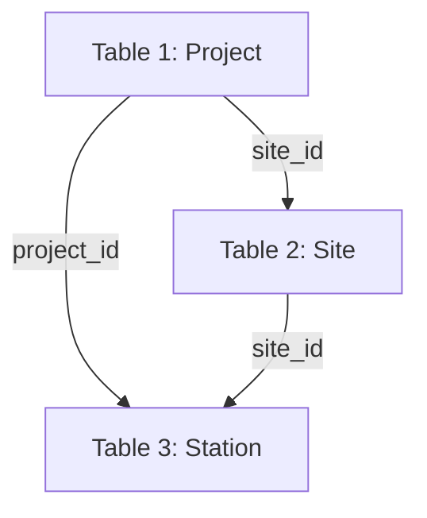
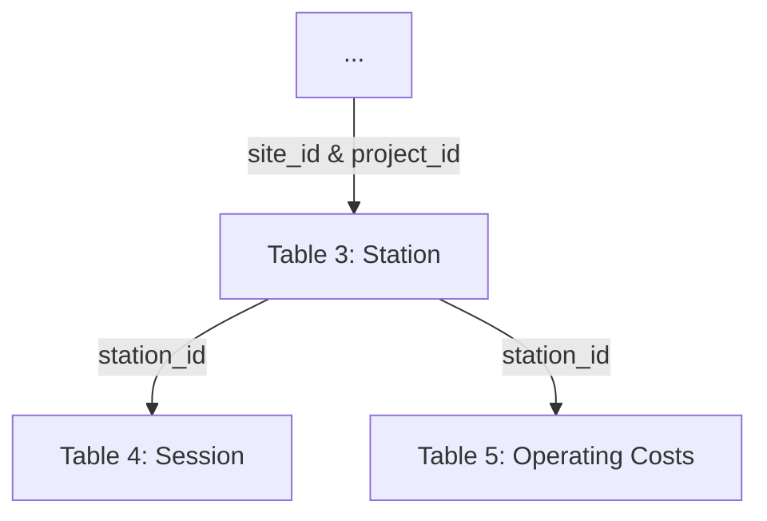

 

 
 # About
The Electric Vehicle Charging Use Data Specification (specification) defines a common format and process for provisioning, collecting, validating and reporting on data related to electric vehicle (EV) charger deployment and use. 

Government and utility funded EV charging station deployment programs are expanding rapidly. Evaluation, measurement and verification of the performance of these public and utility programs requires substantial data collection and processing efforts. A common specification for these data which standardizes input data, processing, and outputs can improve the efficiency and effectiveness of public or ratepayer funded charging programs. Common data reporting requirements across funding programs can reduce compliance burdens for obligated parties. 

# Specification Overview
The specification is flexible and extensible depending on program specifics and evaluation measurement and verification requirements of the funding organization. It is organized into the core specification which details data collection fields, data validations, and reporting outputs for basic tracking, evaluation and verification uses. The specification also supports  extensions that enable additional reporting functionality.

Refer to the [glossary](glossary.md) for definitions of specific termination used in this specification and an outline of the [roles and responsibilities](glossary.md#specification-roles) of the entities involved in the data reporting process. The [field type and format definitions](field-type-and-format-reference.md) reference defines the data types and formats expected in data collection fields.

## Core Specification
 - [Registration and Session Data Collection Reference](core-specification/registration-and-session-data-reference.md) - Format and process for registering participant organizations and funded charging stations and collecting session-level usage data.
 - [Validation Reference](core-specification/validation-reference.md) - Validation procedures and parameters for registrations and session use data.
 - [Reporting Metrics Reference](core-specification/reporting-metrics-reference.md) - Common reporting metrics supported by the specification.

## Specification Extensions

 - Costs data collection [\[FORTHCOMING\]](roadmap.md) — details data collection fields for funding recipient equipment and installation costs.
 - Station reliability [\[FORTHCOMING\]](roadmap.md) — details data collection and procedures for measuring station reliability.
 - Grid impacts [\[FORTHCOMING\]](roadmap.md) — details data collection and procedures for measuring station usage impact on the electricity grid.

# Supplementary Materials

 - [Data Integration Support](supplementary-materials/data-integration-support.md) provides guidance on how to translate out-of-specification registration and usage data into specification-compliant format.
 - [Example Program Language](supplementary-materials/example-program-language.md) for data collection and provisioning requirements set by funding organizations.
 - Example data files for each of the data collection field specifications. [\[FORTHCOMING\]](roadmap.md)

 
# Get Help
Questions about the specification can be directed to info@evchargingspec.org. You can also pose any questions on the [GitHub discussion forum](https://github.com/AtlasPublicPolicy/charging-use-spec/discussions). 

# Get Involved 
We welcome contributions from anyone on the specification. You can contribute directly to the specification development process in a number of ways: 
 
 1. Join a public conversation on the [GitHub discussion forum](https://github.com/AtlasPublicPolicy/charging-use-spec/discussions). 

 2. Participate in a meeting. [Atlas Public Policy](https://atlaspolicy.com) has served as the primary convener of parties interested in contributing to the specification and hosts open meetings. All meetings are recorded and can be watched later. Past and upcoming meetings are available on [evchargingspec.org](https://evchargingspec.org). 

 3. Send an email to info@evchargingspec.org with any questions or feedback. All emails sent to this address related to the specification will be published on GitHub. Please indicate in your email if you would like attribution or if you would like to remain anonymous. This email is monitored by staff at [Atlas Public Policy](https://atlaspolicy.com).

See the [specification roadmap](roadmap.md) for upcoming work on the specification including new components and other related work.  

*The content of this specification is [licensed](LICENSE) under [GNU General Public License v3.0](https://www.gnu.org/licenses/gpl-3.0.en.html)*
# Glossary
Throughout the specification, the following terms are used as defined below
 - **Charging** - When energy is flowing between the charging station and the vehicle.
 - **Connector** - The physical plug/coupler configuration - either standards-based or proprietary.

 - **Data Provider** - The organization that collects and maintains charging use data. May be the Obligated Party or a third party vendor.
 - **Disadvantaged Community (DAC)** - Area typically identified by low-income, historic underinvestment, pollution burdened, or other indicators depending on the jurisdiction.
 - **Idling** - When a vehicle is plugged into a charger but not receiving power. May include time before, after, or between active charging periods.
 - **Network** - Charging Network Service Provider. 
 - **Port** - The individual plug or coupler that physically interfaces with a single vehicle in a one-to-one connection to deliver charge. Ports may be one of any connector types.
 - **Program** - Charger deployment program such as grants, rebates, or direct installation managed by the Program Administrator
 - **Project** - Collection of one or more stations at one or more sites that are attached to the same funding/rebate application or direct installation deployment. Project is defined by the Program Administrator.
 - **Reporting Period** - the program-defined time interval over which data is reported. The reporting period defines the frequency of data collection (e.g. monthly, quarterly, biannually)
 - **Session** - A single charging event, defined as the time between plug-in and plug-out when a single vehicle is connected to a charging port. Can include charging and idle time.
 - **Site Host** - Entity or organization that controls the property where a charging site is located. Often the same as the obligated party.
 - **Site** - The common geographic place (address/parking structure/etc.) where one or more charging stations are located.
 - **Station** - The single charging unit/equipment. One charging station may have multiple charging ports (which may or may not be able to be used simultaneously) and may support multiple connector types.

## Specification Roles
The specification outlines four (4) specific roles in the data collection and reporting process. The roles fall into two (2) categories.
*  **Implementers** — which includes the **Program Administrator** and the **Data Aggregator**
*  **Participants** — which includes the **Obligated Party** and the **Data Provider**

Each role may be filled by a different organization, or one organization may cover the responsibilities of both roles within a category. Table 1 provides a description of each role and their general responsibilities. In both categories, there may be opportunities for repsonibilies to be delegated between roles within the same category.

**Table 1: Roles and Responsibilities**

| **Role** | **Description** | **Responsibilities**
| --- | --- | --- | 
| **Program Administrator** | The organization that manages the charging station deployment program through which station deployments receive funding. Usually a government agency, electric utility, or an agent thereof. | Onboard participants.   Collect inventory data and submit to data aggregator (in compliant format).   Set rules and requirements for data reporting.    Ensure compliance.
| **Data Aggregator** | The entity tasked with gathering, processing, and reporting on the charging use data. Often a third-party contractor, though might also be the same as the Program Administrator.  | Gather inventory data from Program Administrator.   Gather operational data from participants.   Validate, clean, and transform data.  Generate reports and submit Program Administrator.
| **Obligated Party** | The organization responsible for meeting data collection and provisioning requirements. Usually the program funding recipient. | Gather and submit inventory information to Program Administrator.   Collect operations cost data and submit to Data Aggregator (in compliant format).   Ensure Data Provider is meeting reporting requirements.
| **Data Provider** |   The organization that collects and maintains charging use data. Often will be a third party vendor such as a network service provider but may be the Obligated Party if stations are not networked. | Gather and submit inventory information to Program Administrator.   Collect session data and report to Data Aggregator (in compliant format).

# Field Type Definitions
Refer to these field type definitions for data collection formats.
- **Charger Type** - Standard charger type – One of the following: L1, L2, DCFC
- **Connector Type** - Standard connector type – One of the following: J1772, CHAdeMO, Tesla, CCS, CCS/CHAdeMO, CCS/Tesla, CHAdeMO/Tesla, CHAdeMO/CCS/Tesla
 - **Currency** - Currency is a specialized numeric field that contains exactly two significant digits.  *Example: 5.00 but not 5.000 or 5*
 - **Date/time** - string field with the format: YYYYMMDD hh:mm:ss [+/-hh:mm] where time is represented by a 24 hour clock and time in brackets represents the distance from coordinated universal time.  *Example: 20220101 01:01:01 [-5:00] represents January 1, 2022 at 12:01 AM ET*
 - **Duration** - string field with the format HH:MM:SS used to encode elapsed time. *Example: 01:30:00 for 1 hour and thirty minutes*
 - **Email** - properly formatted email address. *Example: example<void>@example.com*
 - **Float** - numeric field that may contain up to seven significant digits. *Example: 1.111 or 1.1111111*
 - **ID** - sequence of UTF-8 characters. ID fields labeled unique must be unique to the conditions described in the field description. ID fields that are labeled foreign reference ID fields in other tables.
 - **Integer** - specific numeric fields which may only contain whole numbers. *Example: 2 or 5 but not 2.1*
 - **Latitude** - WGS84 latitude in decimal degrees to at least 4 decimal places ([EPSG:4326](https://epsg.io/4326)). Must be between -90.0 and 90.0. *Example: 38.8894 for the Washington Monument*
 - **Longitude** - WGS84 longitude in decimal degrees to at least 4 decimal places ([EPSG:4326](https://epsg.io/4326)). Must be between -180.0 and 180.0.  *Example: -77.0352 for the Washington Monument*
 - **Numeric** - A numeric field contains only properly formatted numbers. Empty numeric fields are \<NA>. *Example: 10 or 99 but not 099*
 - **String** - Text field of UTF-8 characters (letters, numbers, punctuation, and symbols). Empty string fields are \<NULL>.
 - **TRUE/FALSE** - Boolean value symbolized by text “TRUE” or “FALSE”
 - **ZIP Code** - valid five-digit ZIP code between 00501 and 99950. *Example: 20500 for the White House*
# Core Specification
The core specification detailes data collection fields, data validations, and reporting outputs for basic tracking, evaluation and verification uses. 

 - [Registration and Session Data Collection Reference](registration-and-session-data-reference.md) - Format and process for registering participant organizations and funded charging stations and collecting session-level usage data.
 - [Validation Reference](validation-reference.md) - Validation procedures and parameters for registrations and session use data.
 - [Reporting Metrics Reference](reporting-metrics-reference.md) - Common reporting metrics supported by the specification.
# Core Registration and Operating Data Collection Reference

This document outlines the process, structure, and format for: 1) registering projects, and associated sites and stations, and 2) collecting core station operating (session & cost) data. These data are then [validated](validation-reference.md) with the resulting information compiled into standard [reporting metrics](reporting-metric-reference).

1. **Registration data** contains records of each project, site and station deployed by the program. These data are collected from the [obligated party](../glossary.md) or [data provider](../glossary.md) at the point of funding by the [program administrator](../glossary.md) and then transmitted to the [data aggregator](../glossary.md).

2. **Use (session) data** contains records of the individual charging sessions at program-funded stations. These data are collected for each reporting period by the [data provider](../glossary.md) and transmitted to the [data aggregator](../glossary.md). Registration information is also used in specification extensions linking to cost [[FORTHCOMING]](roadmap.md), reliability [[FORTHCOMING]](roadmap.md), and grid impact [[FORTHCOMING]](roadmap.md) reporting specifications.

## Contents

1. [Program Registry and Onboarding Process](#program-registry-and-onboarding-process)

	 1. [Project Registration](#project-registration)
	 2. [Site Registration](#site-registration)
	 3. [Station Registration](#station-and-port-registration)

2. [Operating Data Collection](#operating-data-collection)

# Program Registry and Onboarding Process

The program registry contains entries for all charging stations deployed by program funding and is a critical component of the evaluation, measurement, and verification process because it contains the reference information required for program reporting activities. Project registration data is collected and maintained by the [program administrator](../glossary.md) or [data aggregator](../glossary.md). Recommended practice is to integrate registration data collection with administrative onboarding processes to reduce duplicative effort and ensure that all necessary registration data collection occurs prior to funding disbursement. Figure 1 shows the program registry hierarchy with individual identifying keys that link the entries together.

**Figure 1. Registration Hierarchy**

Project registration is tied to a single [obligated party](../glossary.md) and records project-level information such as funding source and amounts. Projects are limited to a single physical address but may cover many individual charging station deployments. Site registration (based on address) is recorded in parallel with project onboarding. While a project is limited to a single site, a site may receive funding from multiple projects over time. If a second project is applied to a site that is already in the system, then it should be linked to the existing site rather than generating a new site entry.

Because charging stations generate usage data, they are the fundamental reporting unit in the program registry. Sessions and other usage data are linked to stations, which inherit all above attributes, making it possible to link each session to the associated site, project, and [obligated party](../glossary.md). In many cases, the [obligated party](../glossary.md) will not be the organization that directly collects charging use data. Instead, many obligated parties will deploy chargers managed by a third party that monitors station usage.

To facilitate efficient data sharing, the third party that monitors station usage may also be designated as the [data provider](../glossary.md), which allows for direct data transfer to the [data aggregator](../glossary.md) and may also provide efficiencies of scale if the third-party [data provider](../glossary.md) is contracted with multiple obligated parties. In this case, the participant must provide the [program administrator](../glossary.md) with station identifiers that are consistent with those used by the [data provider](../glossary.md) as well as the necessary credentials and information to access reported usage data. See model language for data collection [[FORTHCOMING]](roadmap.md) for sample language to facilitate the efficient collection of data.

*Fields marked as required must be included to comply with the specification, while optional fields may be made required at the discretion of the program administrator*

## Project Registration

During project onboarding the [program administrator](global-reference.md) will collect and record project-level information from the applicant [obligated party](../glossary.md) as outlined in Table 1. Project registration includes applicant information and general information on project funding including public/utility funding source and amount, and must be associated with a single geographic location (site). If detailed cost information, including itemized installation costs are desired, please see the installation costs extension [[FORTHCOMING]](roadmap.md).

Refer to [Field Type and Format Reference](../field-type-and-format-reference.md) for more information on field types and formats. *Additional fields may be appended as new columns are needed, but existing columns and their formats should be maintained to support compatibility.*

**Table 1: Project Registration**

| Field | Description | Field Type | Required |
| --- | --- | --- | --- |
| **project\_id** | Unique identity specific project | Data ID (unique) | yes |
| **site\_id** | Unique identity specific to the address-specific site | ID (foreign) | yes |
| **org\_name** | Organization name of the obligated party | string | yes |
| **project\_award\_date** | Date when project funding was awarded | date | yes |
| **poc\_email** | Obligated party point of contact email address | email | yes |
| **poc\_first\_name** | Obligated party point of contact first name | string | yes |
| **poc\_last\_name** | Obligated party point of contact last name | string | yes |
| **primary\_funding\_source** | Primary public funding source for the project/application | string | yes |
| **primary\_funding\_type** | Primary public funding source for the project/application | string | yes |
| **primary\_funding** | Amount of funding station received from the primary funding source dedicated to the charging site (can include funds for installation, e.g., make-ready, equipment, and site preparation, but should not include any funding for station operation) | currency (USD) | yes |
| **utility\_makeready** | Amount of funding the project received from electric utilities dedicated to infrastructure make-ready | currency (USD) | no |
| **utility\_funding\_other** | Amount of funding the project received from utility for equipment or other non-make-ready costs (should not include any funding for operational costs) | currency (USD) | no |
| **other\_makeready** | Amount of other public funding station received dedicated to infrastructure make-ready | currency (USD) | no |
| **other\_funding\_other** | Amount of other public funding project received for equipment or other non-make-ready costs (should not include any funding for operational costs) | currency (USD) | no |
| **cost\_share** | Funding amount project has received from other (private, non-utility) sources when combined with primary\_funding and utility\_funding and other\_public\_funding equals the total cost of the charging installation | currency (USD) | no |
| **in\_dac** | Project is located inside of disadvantaged community as defined by local jurisdiction | TRUE/FALSE | no |
| **dac\_proximate** | Project is located within a program specified distance from disadvantaged community as defined by local jurisdiction | TRUE/FALSE | no |
| **total\_power** | The total charger power capacity (in kW) deployed by the project - if stations share power supplies, only the maximum simulataneous power output should be reported | non-negative float | no

## Site Registration

Also during project onboarding, the [program administrator](../glossary.md) will collect site information from the applicant [obligated party](../glossary.md). If the site address of the project matches a site already in the site registry, then the project should be associated with the existing site\_id.

**Table 2: Site Registration**

| **Field** | **Description** | **Data Format** | **Required** |
| --- | --- | --- | --- |
| **site\_id** | Unique identity specific to the site, must be consistent across reporting periods | ID (unique) | yes |
| **site\_name** | Descriptive name of charging site (e.g., Mercy Hospital) | string | yes |
| **address\_1** | Site street address line one (e.g. 1600 Pennsylvania Ave NW) | string | yes |
| **address\_2** | Site address line two, (e.g. Unit 1) | string | no |
| **city** | Site city | string | yes |
| **state** | Site state (full name) | string | yes |
| **zip\_code** | Site ZIP code | ZIP code | yes |
| **operating\_status** | Operational status of station (Active or Inactive) at time of inventory | string | yes |
| **access\_type** | Type of access available (public/unrestricted, private/restricted) | string | yes |
| **site\_type** | Type of site host for the charging site. | string | yes |
| **host\_first\_name** | Location site host point of contact first name | string | yes |
| **host\_last\_name** | Location site host point of contact last name | string | yes |
| **host\_email** | Location site host point of contact email address | email | yes |
| **onsite\_generation** | Is there onsite energy generation at the site? | TRUE/FALSE | yes |
| **onsite\_generation\_type** | Type of onsite energy generation | string | no |
| **onsite\_generation\_power** | Nameplate capacity of onsite energy generation in kW | positive float | no |
| **onsite\_storage** | Is there onsite energy storage at the site? | TRUE/FALSE | yes |
| **onsite\_storage\_energy** | Energy capacity of onsite energy storage system in kWh | positive float | no |
| **onsite\_storage\_power** | Nameplate capacity of onsite energy storage system in kW | positive float | no |
| **county** | Site county (or county analogue) | string | no |
| **site\_type\_detail** | Additional detail on site host land use | string | no |

## Station and Port Registration

Also during project onboarding, the [program administrator](../glossary.md) will collect station and port information from the applicant [obligated party](../glossary.md). If usage data will be provided by a third-party [data provider](../glossary.md), collecting the station identifier used by that third party to identify specific stations in their system is a critical step in the onboarding process. This ensures that the [data aggregator](../glossary.md) can successfully link usage data secured from the [data provider](../glossary.md) to stations within the registry. The [program administrator](../glossary.md) should also have a process in place to update the station registration if a station is upgraded, taken offline, or if the [data provider](../glossary.md) is replaced.

Each station inherits the attributes of the site where it is located and the project that funded it. Station registration entries also include attributes specific to the individual charging station including exact location, power level, and other station-level attributes as listed in Table 3.

Refer to [Field Type and Format Reference](../field-type-and-format-reference.md) for more information on field types and formats. *Additional fields may be appended as new columns as needed, but existing columns and their formats should be maintained to support compatibility interoperability.*

**Table 3: Station Registration**

| **Field**   | **Definition** | **Data Format** | **Required** |
| --- | --- | --- | --- |
| **station\_id** | Unique identifier of charging station – must match the data provider ID for the station if managed by a third party data provider | ID (unique) | yes |
| **project\_id** | Project identifier | Data ID (foreign) | yes |
| **site\_id** | Location identifier | ID (foreign) | yes |
| **date\_entered** | Date when entry was created | date | yes |
| **station\_serial** | Unique identifier of charging station derived from station serial number or network identifier (e.g., 123-345-2) | ID (unique) | yes |
| **station\_name** | Name of charging station | string | yes |
| **data\_provider\_org** | Data provider organization name – may be the same as obligated party | string | yes |
| **data\_provider\_poc\_email** | Email address for data provider point of contact – may be the same as obligated party point of contact | email | yes |
| **is\_active** | Operational status of station at date entered | TRUE/FALSE | yes |
| **power\_level\_kw** | Maximum charging power level of the station in kilowatts | positive float | yes |
| **num\_ports** | Number of simultaneously usable ports | positive integer | yes |
| **latitude** | Station latitude | latitude | yes |
| **longitude** | Station longitude | longitude | yes |
| **station\_activation\_date** | The first (full or partial) day where the station is fully operable and accessible for its intended purpose | date | yes |
| **charger\_type** | Charging station type (level) | charger type | yes |
| **connector\_type** | Charging connector type(s) | connector | yes |
| **power\_level\_kw** | Maximum charging power level in kilowatts | positive float | yes |
| **energy\_fee** | Fee charged to user per kilowatt-hour | currency (USD) | no |
| **session\_fee** | Fee charged to user per session | currency (USD) | no |
| **time\_fee** | Fee charged to users per minute | currency (USD) | no |
| **parking\_fee** | Fee charged for parking if separate from time\_fee | currency (USD) | no |
| **idle\_fee** | Fee charged for minutes not charging if separate from time fee | currency (USD) | no |
| **operating\_hours** | Number of hours station is open per day—e.g., a station that is always open has a value of 24 whereas a station that is open from 6 am to 6 pm has a value of 12 | positive float | no |
| **model\_number** | Charging station model number | string or integer | no |
| **serial\_number** | Charging station serial number unique to charging equipment provider | string or integer | no |
| **data\_provider\_poc\_last** | Last name of the data provider point of contact | string | no |
| **data\_provider\_poc\_first** | First name of the data provider point of contact | string | no |
| **network** | Name of network service provider (if any) – may be same as data provider| string | no |
| **network\_contact** | Email address for network service provider – may be same as data provider | email | no |
| **evse\_manufacturer** | Charging equipment manufacturer name | string | no |

# Operating Data Collection

Station usage is tracked by collecting data on:
* **individual charging sessions** — the period between when a user connects their vehicle (plug in) and disconnects their vehicle (plug out).  
* **station operating costs** — summary data on energy, maintenance and repair costs over the reporitng interval.  

**Figure 2. Operating Data Reporting Hierarchy**

### Session Data
The [data provider](../glossary.md) collects session data for each reporting period as defined by the [program administrator](../glossary.md). The data is transmitted to the [data aggregator](../glossary.md) by the [data provider](global-reference.md) (or [obligated party](../glossary.md) in the case where they operate their stations). Session data includes key information about how, when, and, for how long a charger is in use over the course of a single session (plug in to plug out). Each individual session should be included in the data only once. If data is collected at a subsession interval, it should be aggregated to the session level by the data provider prior to delivery to the data aggregator. Session data is keyed to the station and individual port (for multiport stations) where it occurred and inherits all above attributes of the participant, project, and site as shown in Figure 2.

Generally, the [data provider](../glossary.md) may transmit session data to the [data aggregator](../glossary.md) by: data portal, FTP, API, email, or other data sharing procedure. While data sharing is designed to be container agnostic, session data must conform to the format described in Table 5 and should be stored in (or convertible to) a broadly compatible container, such as a comma-separated values (CSV) file. Data transmissions procedure and file format may be further specified by the [program administrator](../glossary.md) to suit program needs.

Refer to [Field Type and Format Reference](../field-type-and-format-reference.md) for more information on field types and formats. *Additional fields may be appended as new columns as needed, but existing columns and their formats should be maintained to support compatibility.*

**Table 4: Session Reporting**

| **Field** | **Definition** | **Data Format** | **Required** |
| --- | --- | --- | --- |
| **session\_id** | Session identifier that is unique to port\_id and station\_id | ID (unique) | yes |
| **station\_id** | Station identifier | ID (foreign) | yes |
| **port\_number** | Port identifier that signifies which station port was used (1 for single port stations, 1,2+ for multiport stations) | non-negative integer | yes |
| **plug\_start\_datetime** | Date and time of session initialization (plug in) | date/time | yes |
| **plug\_end\_datetime** | Date and time of session termination (plug out)  | date/time | yes |
| **charge\_start\_datetime** | Date and time when charging began | date/time | yes |
| **charge\_end\_datetime** | Charging end date time | date/time | no |
| **session\_duration** | Total duration of session (plug in to plug out) | duration | no  |
| **charging\_duration** | Total duration of time when electricity was actively dispensed - may not always be equal to the difference between charge\_start\_datetime and charge\_end\_datetime due to charge interruptions or managed charging | duration | yes |
| **energy\_kwh** | Electricity dispensed (in kilowatt-hours) during charging session | non-negative float | yes |
| **peak\_kw** | Session maximum power delivery (in kilowatts) | non-negative float | yes |
| **total\_fee\_charged** | The amount charged to the EV driver, in USD, where applicable - zero if driver was not charged for an otherwise paid charger, NULL if charger is not paid | currency (USD) | yes |
| **energy\_fee** | Fee charged to user per kilowatt-hour | currency (USD) | no |
| **session\_fee** | Fee charged to user per session | currency (USD) | no |
| **time\_fee** | Fee charged to users per minute | currency (USD) | no |
| **session\_initiator** | Method to initiate the charging session | string | no |
| **user\_id** | Anonymized network-specific id for each unique user | string | no |
| **successful\_completion** | Whether or not the session ended as expected | TRUE/FALSE | no |
| **ended\_by** | Cause of the session to end (e.g., unplugged while charging). | string | no |
| **start\_soc** | Battery state of charge at session start represented as a decimal between 0 and 1 | non-negative float | no |
| **end\_soc** | Battery state of charge at session end represented as a decimal between 0 and 1 | non-negative float | no |

**Table 5: Operating Costs Reporting**

Operating costs are collected by the [obligated party](../glossary.md) or the [data provider](../glossary.md). Operating costs data may be submitted by an online form, reporting spreadsheet or other reporting method as specified by the [program administrator](../glossary.md) or [data aggregator](../glossary.md). Because collection of operating costs data is labor intensive, recommended practice is to collect these data on an infrequent basis.

Refer to [Field Type and Format Reference](../field-type-and-format-reference.md) for more information on field types and formats. *Additional fields may be appended as new columns as needed, but existing columns and their formats should be maintained to support compatibility.*

| **Field** | **Definition** | **Data Format** | **Required** |
| --- | --- | --- | --- |
| **station\_id** | Station identifier | ID (foreign) | yes |
| **reporting\_period\_start** | Start date of operations costs reporting period | date | yes |
| **reporting\_period\_end** | End date of operations costs reporting period | date | yes |
| **maintenance\_cost** | Total amount paid for maintenance costs during reporting period | currency | yes |
| **repair\_cost** | Total amount paid for repair costs during reporting period | currency | yes |
| **electricity\_cost** | Total amount paid for station electricity use during reporting period (estimated if station is not individually metered) | currency | yes |
| **electricity\_disbursed** | Amount of energy in kWh delivered by station during reporting period | positive float | yes |
| **network\_costs** | Sum of costs associated with network access, including network service fees, communications costs, transaction fees, etc. | positive float | yes |

# Data Validation

This section describes the individual validations to be performed on the registration and session data that ensure that they conform to specifications and that measurements fall within expected parameters. Data received by the data aggregator may have quality issues caused by measurement or data processing errors that interfere with successful data ingestion or the calculation of valid reporting metrics.

The data validation process performs a series of automated checks on the received data, flagging it as erroneous or non-compliant if such checks fail. Data that passes all validation checks will be considered validated data, meaning that the data aggregator has identified it as compliant with the charging use data specification and certified its use in reporting.

Validations for data fields return one of three results:

**Valid** – entry conforms to expected type, format, and parameters   
**Warning** – entry exceeds parameter(s) range and requires manual quality assurance check  
**Error** – required data missing or not conformant to expected type, format, or parameters  

[Warnings](#warning-validations) result from:
- Measurement parameter validation failures specified in the [Warnings Validations](#warning-validations) section of this document.
- Duplication validation failures.

[Errors](#error-validations) result from:
- Nonconformity with field type and format as specified in the [Field Type and Format Reference](../field-type-and-format-reference.md).
- Missing data specified as required data in the [Field Type and Format Reference](../field-type-and-format-reference.md).
- Select parameter validation failures described in the [Error Validations](#error-validations) section of this document.

## Warning Validations
Measurements that fall outside of designated ranges may indicate potential measurement errors, errors from faulty processing/record keeping, or other causes of invalid data. Because these validation failures may trigger on edge-case measurements that are nonetheless valid, they should be checked manually for possible exclusion from reporting metric calculations.

Duplication of unique ID fields might indicate duplicate records but might also indicate that the ID field has been assigned to a record erroneously. Duplicate records can usually be safely excluded, but other cases require additional attention.

The tables in this section outline the field validation types and parameters that result in a warning flag for registration and session data.

**Table 1. Registration Data Warning Validations**

| **Name** | **Field(s)** | **Type** | **Description and Parameters** |
| --- | --- | --- | --- |
| **Duplicate Project ID** | project\_id | duplicate | The project\_id value already exists in registration data. |
| **Duplicate Site ID** | site\_id | duplicate | The site\_id value already exists in registration data. |
| **Duplicate Site Address** | address\_1  address\_2   city  state    zip\_code | duplicate | The combination of site address field values already exists in registration data. |
| **Duplicate Station ID** | station\_id | duplicate | The station\_id value already exists in registration data. |
| **Power Rating Out of Range** | power\_level\_kw  connector\_type | consistency  range | The power\_level\_kw value is within range consistent with station type. Recommended ranges are: 3.2kW – 19.2kW for L2 connectors and 20kW – 360kW for DCFC connectors. |

**Table 2. Session Data Warning Validations**

| **Name** | **Field(s)** | **Type** | **Description and Parameters** |
| --- | --- | --- | --- |
| **Short Session Duration** | session\_duration  charging\_duration | constraint | The session\_duration or charging\_duration values are less than program defined short duration parameters. Recommended parameter is one minute. |
| **Excess Session Duration** | session\_duration  charging\_duration | constraint | The session\_duration or charging\_duration values are greater than program defined excess session length parameters. Recommended parameters are 2,880 minutes (two days) for session\_duration and 1440 minutes (one day) for charging duration. |
| **Low Energy Delivered** | energy\_kwh | constraint | The energy\_kwh value is less than program-defined low energy parameters. Recommended parameter is 0.5 kWh. |
| **Excess Energy Delivered** | energy\_kwh | constraint | The energy\_kwh value is greater than program-defined excess energy parameters. Recommended parameter no more than 250 kWh. |
| **Charging Exceeds Session Duration** | charging\_duration session\_duration | consistency | The charging\_duration value is greater than the session\_duration value. |
| **Session Power Above Rating** | energy\_kwh  charging\_duration  power\_level\_kw | consistency | The average power delivered (energy\_kwh / [charging\_duration / 60]) is more than 10% higher than rated power (power\_level\_kw \* 1.1). |

## Error Validations

Records flagged with an error should be excluded from the reporting data and referred back to the Data Provider for possible correction. The tables in this section outline the field validation types and parameters that result in an error flag for session data.

**Table 3. Registration Data Error Validations**

| **Name** | **Field(s)** | **Type** | **Description and Parameters** |
| --- | --- | --- | --- |
| **Invalid Geography** | city state zip\_code latitude longitude | cross reference | The station/site geographic identifiers fall outside of the range of the program geography. E.g. zip\_code does not match master list of eligible Zip codes or lat/lon fall outside program area (or bounding box). |
| **Activation Date Out of Bounds** | station\_activation\_date  project\_award\_date | consistency cross reference | The station\_activation\_date and/or project\_award\_date fall after the reportinging period or before the program start date. |
| **No Onsite Generation Parameters** | onsite\_generation  onsite\_generation\_type  onsite\_generation\_power | consistency cross reference | The onsite\_generation\_type and onsite\_generation\_power fields are not NULL if onsite\_generation field is TRUE. |
| **No Onsite Storage Parameters** | onsite\_storage  onsite\_storage\_energy  onsite\_storage\_power | consistency cross reference | The  onsite\_storage\_energy and onsite\_storage\_power fields are not NULL if onsite\_storage field is TRUE. |

**Table 4. Session Data Error Validations**

| **Name** | **Field(s)** | **Type** | **Description and Parameters** |
| --- | --- | --- | --- |
| **Date Outside Reporting Period** | plug\_start\_datetime charge\_start\_datetime | consistency | The plug\_start\_datetime or charge\_start\_datetime values do not fall within the date range of the reporting period. |
| **No Matching Registration** | station\_id | cross reference | The session station\_id is not in the program station registry. |
| **Zero Length Session Duration** | session\_duration charging\_duration | constraint | The session\_duration or charging\_duration values are zero. |
| **Zero Energy Session** | energy\_kwh | constraint | The energy\_kwh value is zero. |
# Reporting Metrics

The station registration and session data can be used for several public/ratepayer-interest or programmatic reasons, such as:

- Tracking progress towards program targets and goals
- Verifying that charging stations are deployed and operating at a minimum level
- Evaluating program performance
- Informing future program design

While the specific reporting requirements will be set at the discretion of the Program Administrator (or other funding organization), this document provides a model list of reporting metrics that are supported by the Charging Use Data Specification. This list is neither meant to be prescriptive nor exhaustive but does provide a menu of potential reporting metrics that might be of interest to Program Administrators. In addition, the dependencies column provides the specific registration and session data collection fields necessary to produce those metrics.

The metrics presented here were derived from [model language](https://www.nescaum.org/documents/evse-data-collection-model-contract-provision-for-public-evse-4-16-21.pdf/) developed by the Northeast States for Coordinated Air Use Management (NESCAUM), program metrics from the Tennessee Department of Environment and Conservation, program metrics from the New York State Energy Research and Development Authority, and metrics from the [DCFC Per-Plug Incentive Program](https://jointutilitiesofny.org/ev/dcfc_incentive_program) and [EV Make-Ready Program](https://jointutilitiesofny.org/ev/make-ready) run by the Joint Utilities of New York.

Note: Program Administrators may also be interested in cost, reliability and grid impact metrics which are included in [[FORTHCOMING]](roadmap.md), [[FORTHCOMING]](roadmap.md), and [[FORTHCOMING]](roadmap.md) extensions.

## Contents
1. [Data Aggregation Levels](#data-aggregation-levels)
2. [Deployment Metrics](#deployment-metrics)
3. [Usage Metrics](#usage-metrics)
   1. [Cumulative Usage Metrics](#cumulative-usage-metrics)
   2. [Average and Median Usage Metrics](#average-and-median-usage-metrics)
   3. [Utilization Rates and Other Metrics](#utilization-rates-and-other-metrics)

## Data Aggregation Levels

Most of the metrics in this document can be aggregated at multiple levels or groupings from the individual station level to the program level, while a few such as _Average Energy Delivered per Station_ or _Stations Without Usage_are only meaningful when reported for a group of stations. Because aggregation is based on descriptive fields in the registration data such as: zip\_code, utility, site\_type, or others, it relies on accurate station registry information. Common aggregations include:

- Programmatic – These aggregations include by rebate/funding type (such as workplace, multi-unit dwelling, or highway corridor) or other programmatic divisions such as stations deployed within designated disadvantaged communities.
- Administrative – These aggregations include administrative groupings such as utility or planning region/organization.
- Other Geographic – Geographic divisions such as site, ZIP code, city, county, or census area.
- Temporal – Most data will be aggregated by reporting period. However, additional time-based aggregations include weekend/weekday or time of day.

Aggregation types are not mutually exclusive. It is often useful to cross-tabulate metrics by two or more different grouping types such as **both** by utility **and** by rebate/funding type.

## Deployment Metrics

Deployment metrics are derived from station registration data and provide high level information about program progress and performance by tracking where and what charging equipment has been deployed and program spending.

|Metric |Description &amp; purpose |Dependencies |
| --- | --- | --- |
| **Station Count** | The count of deployed stations across an aggregation group such as program, disadvantaged community, or station power level. This is a basic metric for tracking program progress towards deployment goals. | station\_id |
| **Port Count** | The count of individual simultaneously usable ports across an aggregation group such as program, disadvantaged community, or station power level. This is a basic metric for tracking program progress towards deployment goals. | num\_ports |
| **New Station Count** | The count of stations deployed within the current reporting period. | station\_id station\_activation\_date |
| **New Port Count** | The count of ports deployed within the current reporting period. | num\_ports station\_activation\_date |
| **Total Incentive Funding** | Cumulative sum of incentive funding spent by the program (or other grouping). This metric tracks program spending on station deployment. | primary\_funding |
| **New Incentive Funding** | Sum of incentive funding spent within the current reporting period. | primary\_funding project\_funded\_date |
| **Incentive Funding Per Station/Port** | Total incentive funding divided by the total number of stations or ports deployed. This metric provides a basic cost-effectiveness measure across a group of stations. | station\_idnum\_ports primary\_funding |
| **New Incentive Funding Per Station/Port** | New incentive funding divided by the number of new stations or ports deployed. This metric provides a basic cost-effectiveness measure for the reporting period across a group of stations. | station\_id num\_ports primary\_funding project\_funded\_date |

## Usage Metrics

Usage metrics are derived from session data and provide granular information about operations and program performance as measured by how deployed stations are used.

### Cumulative Usage Metrics

Cumulative usage metrics are measures that can be summed across any level of aggregation defined in [data aggregation levels](#data-aggregation-levels) and remain interpretable. These metrics, which include fundamental productivity measures such as the count of individual sessions and the amount of energy delivered by chargers, are relevant metrics to evaluate performance from the individual station level, all the way up to the program level.

| Metric | Description &amp; purpose | Dependencies |
| --- | --- | --- |
| **Session Count** | The count of valid, discrete charging sessions within a reporting interval. This productivity metric measures how frequently a charging station (or group of stations) was used during a reporting interval. | session\_id |
| **Energy Delivered** | The sum of energy delivered by a station or group of stations within a reporting interval. This energy delivery metric can be used in program evaluation to estimate performance outcomes such as electric miles traveled and emissions reductions. Units should scale relative to level of aggregation. | energy\_kwh |
| **Time Occupied** | The sum of session duration for all sessions at a station or group of stations. This metric shows how much time within the reporting interval that a vehicle was plugged into a charger. | session\_duration |
| **Time Charging** | The sum of charging duration for all sessions at a station or group of stations. This metric shows how much time within the reporting interval that a vehicle was plugged in and charging. Units should scale relative to level of aggregation. | charging\_duration |
| **Time Idle** | Idle time is the difference between _Time Occupied_ and _Time Charging_. It measures the amount of time when a station is occupied (and therefore unavailable to other users) but not actively delivering energy. Units should scale relative to level of aggregation. | session\_durationcharging\_duration |
| **CO2e Reduction** | Equivalent mass of CO2 reduction attributable to station energy delivery. This metric is the product of _Energy Delivered_ and a program, site, or station-specific coefficient for CO2e reduction per kWh. Units should scale relative to level of aggregation. | energy\_kwh |
| **NOx Reduction** | Mass of NOx reduction attributable to station energy delivery. This metric is the product of _Energy Delivered_ and a program, site, or station-specific coefficient for NOx reduction per kWh. Units should scale relative to level of aggregation. | energy\_kwh |
| **Electric Miles Supported** | Number of electric miles supported by station energy delivery. This metric is the product of _Energy Delivered_ and a program-specific coefficient for miles per kWh. | energy\_kwh |
| **Revenue** | Sum of fees customers paid for charging sessions. This metric tracks the total amount of money, including the amount paid on a per-energy or per-time basis and any other usage fees. | total\_fee\_charged |

### Average and Median Usage Metrics

These metrics are measures of central tendency (mean and median) of usage conditioned on a second value, such as station or session. For example, energy delivered per session where energy delivery is summed over individual sessions and then divided by the count of sessions. These metrics can be calculated across different [data aggregation levels](#data-aggregation-levels), from a single station to groups of stations in the same programmatic, administrative, geographic, or temporal category. **However,  care must be taken when aggregating these metrics.** For example, the average of averages for some metrics, such as the *Average Energy Per Session*, is not a usable statistic unless the underlying individual averages are weighted. In these cases, the metric should be recomputed using the underlying data instead of aggregated from metric computed at a more granular level.

| Metric | Description &amp; purpose | Dependencies |
| --- | --- | --- |
| **Average/Median Energy Delivered per Session** | The average (or median) energy delivered (in kWh) during charging sessions at an individual or group of stations. It is a productivity metric that measures typical intensity of charging use at individual or groups of charging stations. | energy\_kwh |
| **Average/Median Energy Delivered per Station/Port** | The average (or median) energy delivered (in kWh) per station/port for a group of stations. It is a productivity metric that measures typical intensity of charging use across a group of stations (such as by geography, utility, or program). | station\_id energy\_kwh |
| **Average/Median Session Duration** | The average (or median) session duration for an individual or group of chargers. It is a usage metric that measures the typical duration of sessions at an individual or group of chargers. | station\_id session\_duration |
| **Average/Median Charging Duration** | The average (or median) session duration for an individual or group of stations. It is a usage metric that measures the typical duration of charging (time when energy is being delivered) at an individual or group of chargers. | station\_id charging\_duration |
| **Average/Median Idle Time** | The average (or median) session duration for an individual or group of stations. It is a usage metric that measures the typical duration of charging (time when energy is being delivered) at an individual or group of chargers. | station\_id session\_duration charging\_duration |
| **Average/Median Unique Users by Station** | The average (or median) count of unique users by station. This metric measures typical number of unique users across a group of stations (such as by geography, utility, or program). | station\_iduser\_id |

### Utilization Rates and Other Metrics

Metrics in this section include station utilization and other metrics that could be useful in program evaluation. These metrics can be aggregated or recalculated at different [data aggregation levels](#data-aggregation-levels) , though not all metrics are meaningful or possible across all aggregation levels. For example, *Stations Without Use* can only be tracked across a group of stations as it is not meaningful for individual stations where it can only be zero or one.

| Metric | Description &amp; purpose | Dependencies |
| --- | --- | --- |
| **Occupied Utilization Rate** | The sum of _Time Occupied_ divided by the total amount of available time (defined using station open hours) within the reporting period expressed as a percentage. This metric measures the fraction of time during which a station or group of stations are occupied. | session\_duration station\_id operating\_hours |
| **Station Utilization Rate** | The sum of _Time Charging_ divided by the total amount of available time (defined using station open hours) within the reporting period expressed as a percentage. This metric measures the fraction of time during which a station or group of stations are occupied and actively charging. | charging\_duration station\_id operating\_hours |
| **Idle Utilization Rate** | The sum of _Time Idle_ divided by the total amount of available time (defined using station open hours) within the reporting period expressed as a percentage. This metric measures the fraction of time during which a station or group of stations are occupied and not actively charging. | session\_duration charging\_duration station\_id operating\_hours |
| **Capacity Factor** | The sum of _Energy Delivered_ divided by the station&#39;s power rating multiplied by the number of available hours (defined using station open hours) expressed as a percentage. This metric provides a summary of electrical capacity utilization (ratio of energy delivered to total possible energy delivery) at an individual or group of stations. | energy\_kwh station\_id power\_level\_kw |
| **Site Congestion Rate** | The sum of time where all stations at a site are occupied at the same time divided by the total amount of available time (defined by station/site open hours). This metric provides a summary of time that a site is fully utilized/congested. This metric can only be calculated at the site level, though can be averaged over a group of sites. | session\_start\_time session\_duration site\_id |
| **Average Sessions per Day/Week** | The average (or median) number of sessions for an individual or group of stations by day or week. This metric measures usage frequency on an easy-to-interpret time basis that is different from the reporting period. | station\_id |
| **In-use Days** | The count of days within the reporting period where a station had at least one session. This metric that provides information on the regularity of charging use at a station or group of stations. | station\_id |
| **Stations Without Use** | The count of stations that had no associated sessions during the reporting period. Tracks unused station counts across a group of stations (such as by geography, utility, or program). | station\_id |
| **Unique Users** | Count of unique users that have used a station or group of stations within the reporting period. This metric measures the breadth of stations&#39; user base. Note that aggregation depends on compatible user IDs between different stations, meaning that this metric will generally not aggregate outside of a single data provider. | user\_id |

# Supplementary Materials

1. [Data Integration Support](data-integration-support.md)
2. [Example Program Language](example-program-language.md)
# Data Integration Support

The EV Charging Use Data Specification is meant to provide a pathway for industry and regulators to develop a common method by which to track charging use data that increases usability of the data and reduces effort for all involved. However, because these data are currently collected and stored in a fragmented and ad hoc way, challenges are likely in the transition process, especially as this specification is implemented in places where legacy reporting processes are already in place.

This reference documents common data quality and conformity issues encountered in past EV charging use data collection efforts and provides methods to address those issues to create specification compliant data. It is presented here as guidance for Data Providers and Program Administrators to handle conversions from internal or legacy data formats to specification-ready data, or for Data Aggregators that encounter out-of-specification data submitted by Data Providers or Program Administrators.

## Contents

1. [General Transformations](#general-transformations)
2. [Registration Data](#registration-data)
3. [Session Data](#session-data)

## General transformations
To transform non-conformant source data to a specification-ready format the following general steps should be followed

- Rename alternatively-named fields to specification-standard field names if field values are consistent.
- Type-define fields and ensure that empty fields are either NULL (if numeric) or NA (if string).
- Assign fields to appropriate project, site, or station table if provided in same table in source data
- Append fragmented records into single project, site, station, or session tables

## Registration Data

Registration data is often entered manually using software that does not allow for robust entry checking and is therefore prone to error. Furthermore, registration data may be sourced from program information that was not expressly collected to build a station registry for reporting purposes and therefore might differ substantially from the fields defined in the specification.

Common issues with missing, incomplete, or incompatible fields and solutions/workarounds for those issues are described in the table below.

**Table 1. Common Registry Data Quality Issues**

| Issue | Field(s) | Solution/Transformation |
| --- | --- | --- |
| Missing, incomplete, or erroneous station\_id field. | station\_id |The station identifier is a critical link between registration data and session data without which, most reporting is impossible. If station\_id is missing, incomplete or incorrectly entered in the source data, it may be possible to link registration data to session data using the station\_serial field (if provided) and the network name. Once linked, the station\_id field may be back-filledbackfilled into the registration data using a lookup table based on session reporting.  If no match is found, it may be possible to work with the program administrator and/or the data provider to create an override table that replaces or fills in corrected station\_id using station serial numbers.|
| No charging site registration | site\_id | If source data do not include a site registration structure but station addresses are reported, the site registration table can be constructed by grouping stations by common address fields. A site\_id may be generated for each unique address and any site\_id attributes reported at the station level may be promoted to the charging site registration table. |
| Connector type does not match formatting for _connector_ in the data types and formats reference | connector\_type | If connector type is reported in the source data in a consistent way then a lookup table can be used to crosswalk the non-standard entries to standard values. If connector type is not reported consistently, then manual correction may be required. |

## Session Data

Individual data providers have unique internal data structures in which they store and report on charging sessions. Due to this fragmentation, session data sourced from data providers internal databases or data sharing portals may require substantial modification in order to comply with the specification.

The table below details common issues with missing, incomplete, or incompatible fields and solutions/transformations that can be used to conform session source data with the specification.

**Table 2. Common Session Data Quality Issues**

| **Issue** | **Field(s)** | **Solution/Transformation** |
| --- | --- | --- |
| **Session data records missing identifier** | session\_id | If source data does not provide a session id, and session\_id is not required to link session data to extended usage data such as electric grid impact (intervals), a unique identifier may be generated and assigned to each session after a duplicate check that ensures that no duplicate session records exist in the dataset. |
| **Station identifier missing** | station\_id | The station identifier is a critical link between session data and registry data. If station\_id is not available in the source data, session data may be linked to station registration table using the station\_serial field (if provided) and the network name. Once linked, the station\_id field can be back-filled from the registration record.     If no match is found, further information is required from the data provider or program administrator to successfully match session data to station.|
| **Missing port number** | port\_number |If port\_number is unavailable in the source data and the associated station is a single-port station, port\_number is assigned to 1.     If the associated station is a multi-port station, then further information is required from the data provider. |
| **Non-standard or separated date/time field(s)** | plug\_start\_datetime | If a full datetime value is provided in the source data in a non-standard format, it should converted to the specified date/time format.    If date and time are provided separately, they should be combined in the specified data/time format. Where a time zone is not indicated, assume time is localized to station location. |
| **Non-standard or missing session duration or charging duration** | session\_duration | If session duration or charging duration are reported in a non-standard format, reformat to specified format with as much precision is possible given duration input.    If no session\_duration is available in the source data, but a plug\_end\_datetime is provided, session\_duration can be calculated as plug\_end\_datetime minus plug\_start\_datetime.     If charging\_duration is not available but time idle is reported in the source data, charging\_duration can be calculated as session\_duration minus idle\_time. |
| **Session energy reported in unit other than kWh** | energy\_kwh | If session energy delivery is reported in a way that indicates use of an energy unit other than kWh, then that field can be converted to energy\_kwh using standard conversion factors (e.g. energy reported in MWh can be converted to kWh by multiplying MWh by 1,000). |
| **Session peak power reported in unit other than kW** | peak\_kw | If session peak power is reported in a way that indicates use of an energy unit other than kW, then that field can be converted to peak\_kw using standard conversion factors (e.g. energy reported in MW can be converted to kW by multiplying MW by 1,000). |

# Example Program Language

This section is intended to provide example language to include in program documentation for participants to provide clarity on the use of data being collected. The example documentation was adapted from program documentation for the [PON 4743](https://portal.nyserda.ny.gov/servlet/servlet.FileDownload?file=00Pt000000aumUtEAI) from the New York State Energy Research and Development Authority.

Below are terms that are specific to the program.

- [DELIVERABLE]: These includes report or other deliverables related to the program.
- [ENTITY]: This is intended to be the public or private entity that is administering the program.
- [STATEMENT OF WORK]: The main statement of work for program.

The below text is available in binary format for use in word processing applications here: [example-program-language.odt](https://github.com/AtlasPublicPolicy/charging-use-spec/raw/main/supplementary-materials/example-program-language.odt)

## Definitions

**Contract Information** : Recorded information regardless of form or characteristic first produced in the performance of this Agreement, that is specified to be compiled under this Agreement, specified to be delivered under this Agreement, or that is actually delivered in connection with this Agreement, and including the [DELIVERABLE] delivered by Contractor pursuant to [STATEMENT OF WORK], if applicable.

**Proprietary Information** : Recorded information regardless of form or characteristic, produced or developed outside the scope of this Agreement and without [ENTITY] financial support, provided that such information is not generally known or available from other sources without obligation concerning their confidentiality; has not been made available by the owner to others without obligation concerning its confidentiality; and is not already available to [ENTITY] without obligation concerning its confidentiality. Under no circumstances shall any information included in the [DELIVERABLE] delivered by Contractor pursuant to [STATEMENT OF WORK], if applicable, be considered Proprietary Information.

## Rights in Information; Confidentiality

[ENTITY] shall have the right to use, duplicate, or disclose Contract Information, in whole or in part, in any manner and for any purpose whatsoever, and to permit others to do so.

The Contractor shall have the right to use Contract Information for its private purposes, subject to the provisions of this Agreement.

[ENTITY] shall have no rights to any Proprietary Information.

No information shall be treated by [ENTITY] as confidential unless such information is clearly so marked by Contractor at the time it is disclosed to [ENTITY]. Under no circumstances shall any information included in the [DELIVERABLE] delivered by Contractor pursuant to [STATEMENT OF WORK] be considered confidential or Proprietary Information.

The Contractor agrees that to the extent it receives or is given any information from [ENTITY] or a [ENTITY] contractor or subcontractor, the Contractor shall treat such data in accordance with any restrictive legend contained thereon or instructions given by [ENTITY], unless another use is specifically authorized by prior written approval of the [ENTITY] Project Manager. Contractor acknowledges that in the performance of the [STATEMENT OF WORK] under this Agreement, Contractor may come into possession of personal information. Contractor agrees not to disclose any such information without the consent of [ENTITY].

In conjunction with Contractor&#39;s performance of the [STATEMENT OF WORK], [ENTITY] or other entities may furnish Contractor with information concerning the [STATEMENT OF WORK] that is collected and stored by, or on behalf of, [ENTITY] (the &quot;Information&quot;).

Any non-public, confidential, or proprietary Information will be kept confidential and will not, without [ENTITY]&#39;s prior written consent, be disclosed by Contractor, Contractor&#39;s agents, employees, contractors or professional advisors, in any manner whatsoever, in whole or in part, and will not be used by Contractor, Contractor&#39;s agents, employees, contractors or professional advisors other than in connection with the [STATEMENT OF WORK]. Contractor agrees to transmit the Information only to Contractor&#39;s agents, employees, contractors and professional advisors who need to know the Information for that purpose and who are informed by Contractor of the confidential nature of the Information and who will agree in writing to be bound by the terms and conditions of this Agreement.

Contractor will keep a record of the location of the Information. At the conclusion of the Project Period, Contractor will return to [ENTITY] all the Information and/or provide proof to [ENTITY] that the Information was destroyed. Contractor also agrees to submit to an audit of its data security/destruction practices by [ENTITY] or its representative during the contract term and for up to two (2) years following the expiration of the Agreement.

If, in the course of performance of the Agreement, Contractor or Subcontractors (if any) encounter any information in [ENTITY] database platforms that a reasonable person would identify as unrelated to the Agreement or otherwise inadvertently produced to Contractor or Subcontractors, Contractor shall notify [ENTITY] immediately and neither Contractor nor Subcontractor shall use such inadvertently produced information for its own use. Any Contractor access to [ENTITY] information shall be used solely for [ENTITY]-related matters.